> 在文档智能解析（IDP）、OCR 以及版面分析任务中，输入图像的质量直接决定了最终效果的上限。然而在实际生产环境中，我们面临的数据往往不是完美的扫描件——\*\*页面倾斜、方向颠倒（90°/180°旋转）\*\*是极为常见的“杀手级”噪声，它们会导致文字识别乱码、版面分析错位，甚至让模型完全失效。
>
> 很多现有的开源方案要么只处理小角度倾斜，要么只处理方向分类，很难应对复杂多变的真实场景。本文将分享一套在实际项目中打磨出的**完整文档图像矫正方案**。我们将结合**基于频谱分析的传统图像处理算法**（解决任意角度倾斜）与**轻量级深度学习分类模型**（解决方向旋转），实现对文档图像的“归零”校正。
>
> 本文不仅包含核心算法原理与性能对比，还提供了**开箱即用的 Python 代码**，助你快速优化 OCR 前处理流程。

---

对于文档解析任务如layout、ocr等，部分输入数据可能存在页面倾斜和方向旋转的问题，导致解析效果极差。这篇文章分享下个人探索得到的方法，通过图像处理和集成已有模型来消除倾斜和旋转，让文档图像角度为0以便后续的解析。

需要说明，本文介绍的所有方法，只适用于文档图像，照片之类的不适用。

## 一、数据展示

此处先说明数据可能是什么样的和本文的一些定义。

默认为文字可正常阅读的情况为角度0度，因此横向页面和竖向页面对于角度没影响，是否为0度只取决于文字是否”正“。

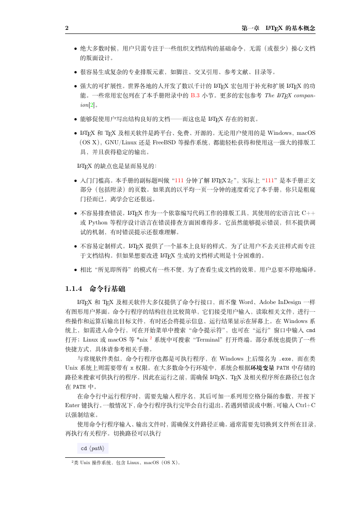

0度的文档图像

第一种数据，倾斜图片：整体旋转角度不超过正负45度，如下图所示。

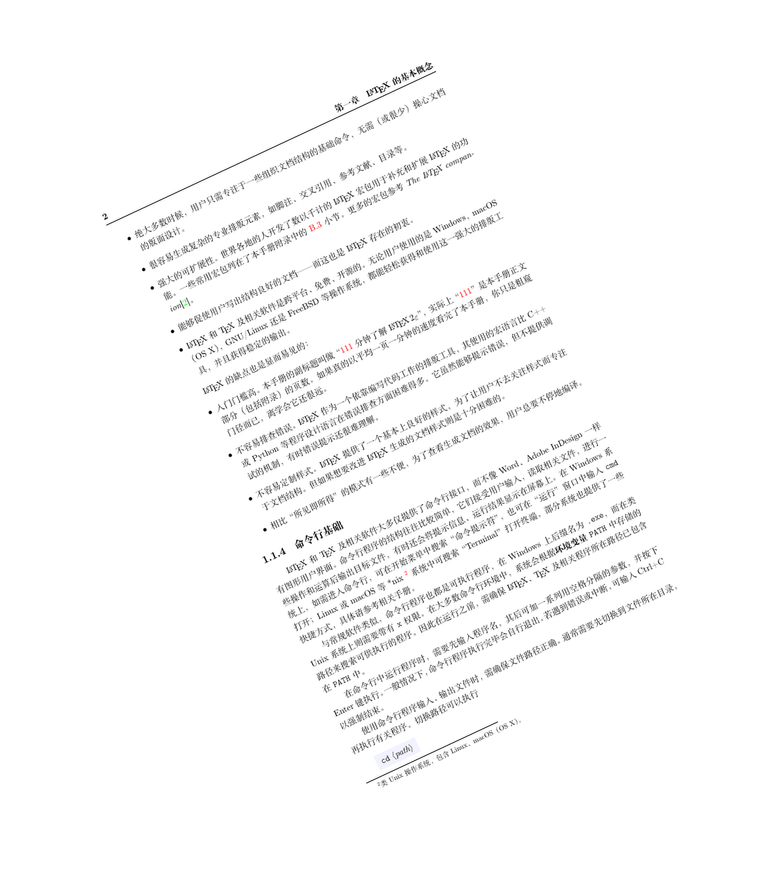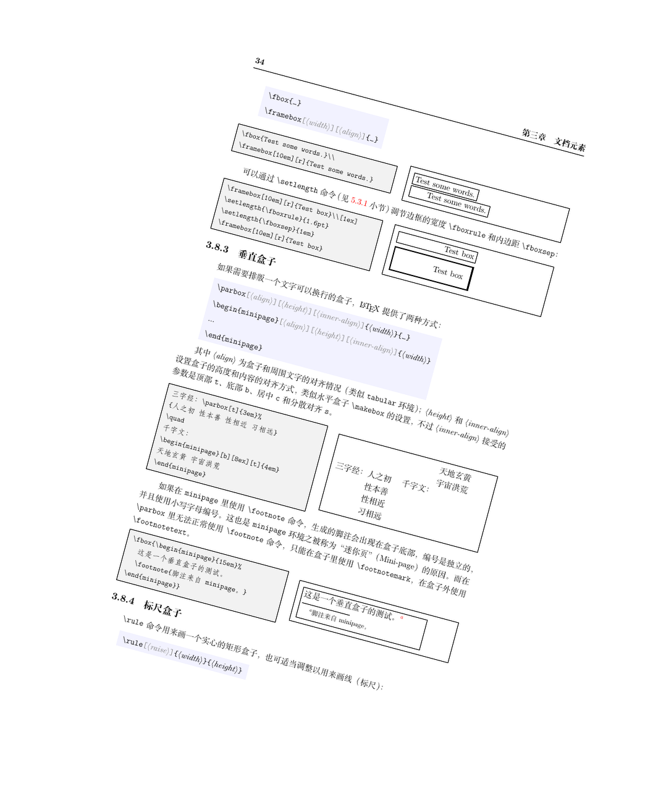

解决办法：图像处理即可，精度很高，速度也比较快，且无副作用，至少不会更坏。需要注意，去倾斜方法也可用于大于45度旋转的图片，但无法保证会将图片旋转回0度，而只能是90度的倍数的角度的一种。详见本文的二、部分。

第二种数据，旋转图片：旋转角度是0、90、180、270度中的一种，如下图所示。

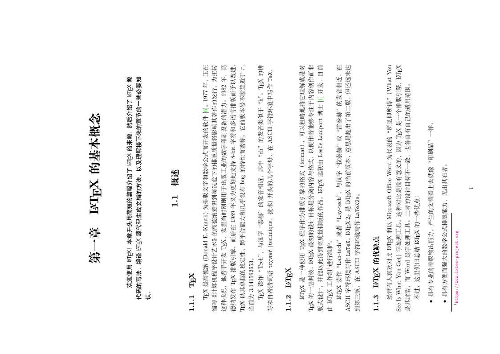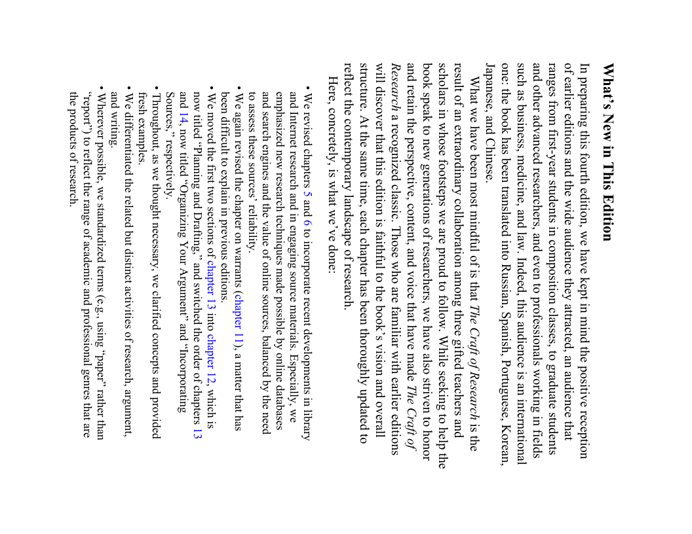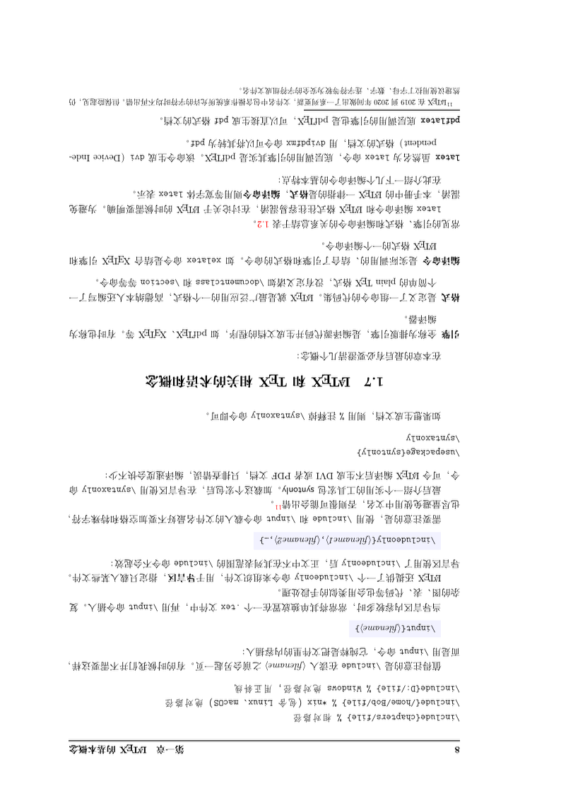

解决办法：使用文档图像方向分类模型进行判别并旋转回0度，但是有较小概率出错，建议搭配置信度阈值分条件处理。详见本文的三、部分。

第三种数据，不知道具体旋转角度，可能是-180到+180度的任一角度，如下图所示。

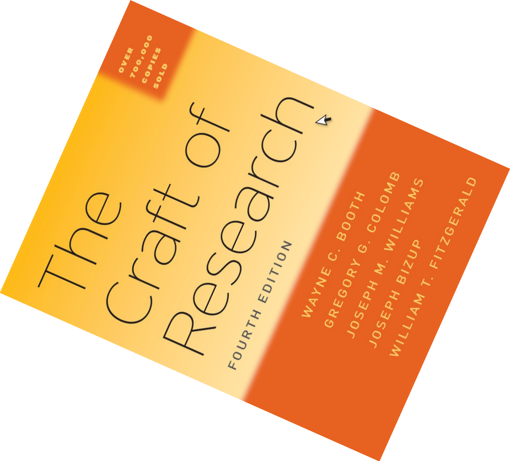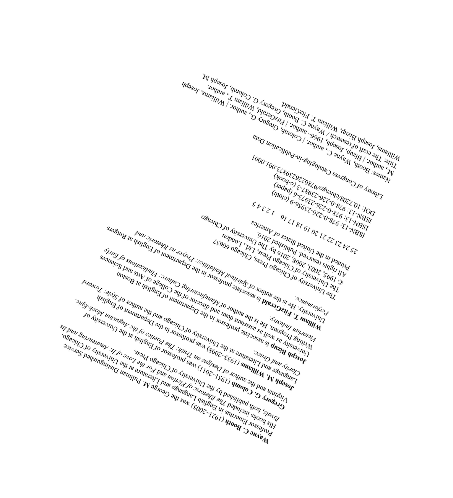

解决办法：先去倾斜，再做方向分类。详见本文的4. 部分。

实际文档解析中，第一种数据如略微倾斜的扫描件，第二种如竖向排版文档中夹杂的极少数正负90度的横向文档。都只需要单独去倾斜或者旋转校正即可，但个人还是更推荐采用先去倾斜再方向分类做校正的方案。一是为了应对极少数罕见数据，比如转了108度的图片，二是去倾斜加方向矫正省心，除了增加一点计算量以外没其他缺点。

后续会先分别介绍第一种和第二种的解决方案和示例，最后介绍如何结合两种方法以应对图片旋转角度任意的情况。

## 二、文档图像去倾斜（Document Image Skew Estimation）

这个最简单，有现成的python库：

```bash
pip install jdeskew
```

github链接：[phamquiluan/jdeskew: ICIP 2022: Adaptive Radial Projection on Fourier Magnitude Spectrum for Document Image Skew Estimation](https://github.com/phamquiluan/jdeskew)

用法：

```python
from jdeskew.estimator import get_angle
angle = get_angle(image, vertical_image_shape = 2048, angle_max = 45.0)

from jdeskew.utility import rotate
output_image = rotate(image, angle)
```

此处计算到的`angle`，大于0代表图片顺时针转了`angle`度，小于0代表图片逆时针转了`abs(angle)`度，如果不用库自带的旋转函数，需要注意。

虽然有现成的库，但是出于不引入额外的依赖考虑，加上这个库只依赖opecnv和numpy，建议根据源码自己在项目中实现一份。

该方法不需要训练模型，全部基于图像处理实现。

输入输出示例：


输入图片

方法计算的旋转角度为-25.038910505836576°。

校正后：

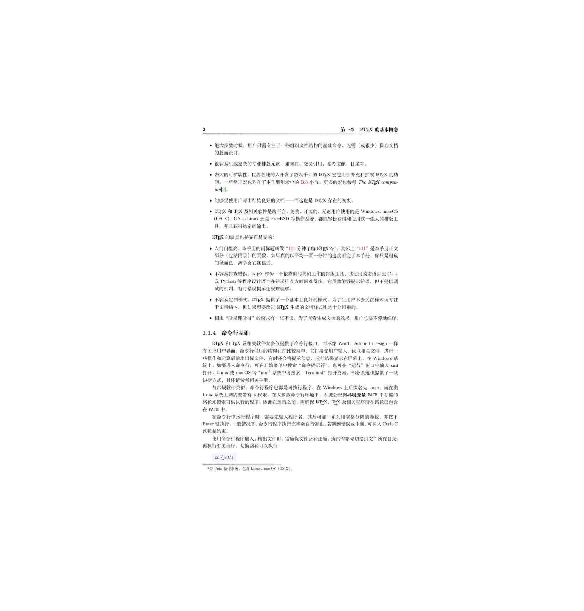

校正后的白边较多是因为个人写的图像旋转函数优先考虑了保留原图的所有内容，因此白色画布较大。如果需要突出有字迹部分的内容，可以通过图像预处理来裁剪掉过多的白边，见本文五、。

只是需要应用的到这里就可以去看三、了，以下就是个人做的实验，对比不同方法的精度和速度，结论可以直接跳转到 *8. 去倾斜方法总结* 。

### 方法说明

在基于频谱分析的图像去倾斜任务中，对比了三种不同的实现路径。虽然它们的核心思想都是利用傅里叶变换（FFT）的频谱能量分布来检测文本行的倾斜角度，但在具体的搜索策略和鲁棒性处理上存在显著差异。

#### 1. jdeskew exp 方法（论文复现版）

这是对 jdeskew 原始论文（及 `reproduce.ipynb`）的忠实复现。它的核心特点是**自适应性（Adaptive）** 。

- **双角度计算**：该方法同时计算两个候选角度：

  - **`a_init`**：基于全频谱的径向投影计算出的角度，稳定性好，但可能受文档背景或低频噪声干扰。
  - **`a_correct`**：屏蔽掉频谱中心低频分量（由参数 `W` 控制遮挡宽度）后计算出的角度，对文本纹理的高频成分更敏感，潜在精度更高。
- **动态决策机制**：通过比较两个角度的差异 `dist = |a_init - a_correct|` 与阈值 `D`（如 0.55）：

  - 若 `dist <= D`，认为中心遮挡后的结果可信，采用高精度的 **`a_correct`**。
  - 若 `dist > D`，认为高频噪声过大或纹理不清晰，回退采用更稳健的 **`a_init`**。
- **特点**：这是一种"双保险"策略，在精度和稳定性之间做了动态平衡，但依赖于对 `W` 和 `D` 两个超参数的调优。

#### 2. jdeskew lib 方法（官方库版）

这是作者发布的 Python 库（`pip install jdeskew`）中的实现。相较于 `exp` 方法，它进行了大幅简化，旨在提供一个开箱即用的通用版本。

- **核心简化**：移除了中心遮挡参数 `W` 和决策阈值 `D`，直接对整个频谱图进行径向投影积分，仅返回单一角度。
- **与 exp 的关系**：从代码逻辑看，它等同于只保留了 `exp` 方法中的 **`a_init`** 计算分支，完全去除了自适应校正逻辑。
- **适用场景**：计算更直接，速度稍快，且无需调参。但在复杂背景或文本纹理较弱的场景下，由于缺乏 `a_correct` 的高频增强和 `D` 的异常回退机制，精度可能不如 `exp` 方法极致。

#### 3. My方法

个人基于 `jdeskew exp` 进行的改造。根据代码分析，不同于原论文的"阈值切换"逻辑，采用了更确定性的 **Coarse-to-Fine（粗细两阶段）搜索策略**。

- **两阶段搜索**：

  1. **粗略估计（Coarse）** ：首先在较大范围内（如 -90° 到 90°），以较大步长（如 1.0°）快速定位能量最强的粗略角度。
  2. **精细估计（Fine）** ：在粗估角度的邻域内（如 ±2°），以极小步长（如 0.1°）进行密集插值搜索，锁定最终精确角度。
- **思路演变**：

  - 不再纠结于 `a_init` 和 `a_correct` 的选择困境（不再需要阈值 `D` 进行回退判断）。
  - 通过"粗定位+精搜索"的机制，实质上强制执行了类似 `a_correct` 的高精度路径，同时避免了单次细粒度搜索带来的巨大计算开销。
  - 代码中虽然保留了小幅度的中心遮挡（半径为 2），但主要依靠搜索策略的提升来保证精度。
- **特点**：这种方法更加"自信"且确定性强，通过增加计算密度（两轮搜索）换取更高的角度分辨率。准确率比lib好但不如exp，速度比较快。

### 精度评估指标

来自[phamquiluan/jdeskew: ICIP 2022: Adaptive Radial Projection on Fourier Magnitude Spectrum for Document Image Skew Estimation](https://github.com/phamquiluan/jdeskew)作者的论文。

- **AED (Average Estimating Deviation):**  平均估计偏差，越低越好。
- **TOP80:**   取按误差从小到大排序后前 80%（最好的 80%）样本的平均偏差
- **CE (Correct Estimation Rate):**  准确率（通常指偏差 $\le 0.1^\circ$ 的比例）。
- **WORST:**  最大偏差值，反映算法的稳定性。

### 数据集说明和展示


DISE 2021 (15°) 数据集：包含 **4,890** 张图像（由 3,399 张开发图像和 1,491 张测试图像组成 ），其图像偏斜角度范围设定在 **$-15^{\circ}$** **至** **$+15^{\circ}$** 之间 ，数据示例见上图。


DISE 2021 (45°) 数据集：包含 **9,780** 张图像（由 6,980 张开发图像和 2,800 张测试图像组成 ），其图像偏斜角度范围扩大至 **$-44.9^{\circ}$** **至** **$+44.9^{\circ}$** 之间 ，数据示例见上图。

 自建数据集 angle14\angle30\angle42：从网上找了个所有图像都为0度的中文学术论文扫描图像数据集，随机旋转制作而成。angelXX代表图像偏斜角度范围设定在-XX度至+XX度之间。图像数量分别为370、397和400张，不划分开发和测试集。

### 方法介绍

**jdeskew-lib (amax=45)：**

使用jdeskew库计算角度，其中amax的值代表只会在正负45度范围之内进行估计，代码示例：

```python
from jdeskew.estimator import get_angle
angle = get_angle(image, vertical_image_shape = 2048, angle_max = 45.0)
```

**jdeskew-exp (amax=15, V=3072, D=0.55)：**

基于jdeskew库作者的实验代码计算角度，精度更高但速度稍微慢，见链接：[jdeskew/reproduce.ipynb at master · phamquiluan/jdeskew](https://github.com/phamquiluan/jdeskew/blob/master/reproduce.ipynb)，其中的**amax=15, V=3072, D=0.55**代表参数设置，amax代表角度估计范围的绝对值，V代表预处理会将图像保持比例resize到高度为V，V越大性能越好，耗时越长，D代表阈值，abs(a\_init - a\_correct) <\= D，则返回 a\_correct（修正角度，去掉了中心遮挡的影响），否则，返回 a\_init（初始角度）。

📄 **完整实现代码请参阅**：[for_eval_deskew/jdeskew_exp_eval.py](for_eval_deskew/jdeskew_exp_eval.py)

该评估程序包含：
- 核心算法（忠实还原 reproduce.ipynb）
- 多进程并行评估框架
- 完整的评估指标计算和结果保存

**运行示例**：
```python
python for_eval_deskew/jdeskew_exp_eval.py
```

**My (个人改进)：**

参考**jdeskew-exp**，抽取出了速度更快，精度凑合的方法。

📄 **完整实现代码请参阅**：[for_eval_deskew/my_method_eval.py](for_eval_deskew/my_method_eval.py) 和 [for_eval_deskew/deskew_angle_only.py](for_eval_deskew/deskew_angle_only.py)

该评估程序包含：
- 改进的去倾斜算法（Coarse-to-Fine 搜索策略）
- 多进程并行评估框架
- 完整的评估指标计算和结果保存

**运行示例**：
```python
python for_eval_deskew/my_method_eval.py
```

### 结果展示

#### 1. DISE 2021 (15°) 数据集性能对比

此数据集主要测试小角度范围内的纠偏精度。

| **方法 / 配置** | **AED (↓)**       | **TOP80 (↓)**       | **CE (↑)**       | **WORST (↓)**       |
| -- | -------- | -------- | -------- | -------- |
| **My (个人改进)** | 0.08° | 0.04° | 76.00% | **1.08°**       |
| **jdeskew-lib (amax=45)** | 0.12° | 0.08° | 55.80% | 1.11° |
| **jdeskew-exp (amax=15, V=3072, D=0.55)** | **0.07°**       | **0.03°**       | **86.00%**       | 1.13° |

---

#### 2. DISE 2021 (45°) 数据集性能对比

此数据集包含较大旋转角度，对算法的鲁棒性要求极高。

| **方法 / 配置** | **AED (↓)**       | **TOP80 (↓)**       | **CE (↑)**       | **WORST (↓)**        |
| -- | -------- | -------- | -------- | --------- |
| **My (个人改进)** | 0.11° | 0.05° | 74.00% | 88.61° |
| **jdeskew-lib (amax=45)** | 0.11° | 0.06° | 67.57% | 43.05° |
| **jdeskew-exp (amax=45, V=3072, D=0.55)** | **0.05°**       | **0.02°**       | **89.00%**       | **1.06°**        |

---

#### 3. 自建数据集 angle14 性能对比

主要测试在 14° 左右偏移时的表现。

| **方法 / 配置** | **总数**    | **AED (↓)**       | **TOP80 (↓)**       | **CE (↑)**       | **WORST (↓)**       |
| -- | ----- | -------- | -------- | -------- | -------- |
| **My (个人改进)** | 370 | 0.33° | 0.21° | 42.16% | 1.00° |
| **jdeskew-lib (amax=45)** | 370 | 0.37° | 0.25° | 34.86% | 1.08° |
| **jdeskew-exp (amax=45, V=2048)** | 370 | **0.04°**       | **0.03°**       | **99.73%**       | **0.13°**       |

---

#### 4. 自建数据集 angle30 性能对比

测试在 30° 中等角度下的识别效果。

| **方法 / 配置** | **总数**    | **AED (↓)**       | **TOP80 (↓)**       | **CE (↑)**       | **WORST (↓)**       |
| -- | ----- | -------- | -------- | -------- | -------- |
| **My (个人改进)** | 397 | 0.44° | 0.34° | 18.39% | 1.00° |
| **jdeskew-lib (amax=45)** | 397 | 0.49° | 0.39° | 11.34% | 1.03° |
| **jdeskew-exp (amax=45, V=2048)** | 397 | **0.04°**       | **0.03°**       | **99.75%**       | **0.13°**       |

---

#### 5. 自建数据集 angle42 性能对比

测试在接近 45° 极限角度下的识别效果。

| **方法 / 配置** | **总数**    | **AED (↓)**       | **TOP80 (↓)**       | **CE (↑)**       | **WORST (↓)**       |
| -- | ----- | -------- | -------- | -------- | -------- |
| **My (个人改进)** | 400 | 0.46° | 0.36° | 18.25% | 1.00° |
| **jdeskew-lib (amax=45)** | 400 | 0.50° | 0.40° | 11.00% | 0.99° |
| **jdeskew-exp (amax=45, V=2048)** | 400 | **0.04°**       | **0.03°**       | **99.50%**       | **0.18°**       |

#### 6. 速度对比

各算法在各数据集上的单张平均耗时（秒）。

| **数据集** | **My (run_eval)**       | **Lib (amax=45)**       | **Exp (V1024)**       | **Exp (V1500)**       | **Exp (V2048)**       | **Exp (V3072)**       | **Exp (V4096)**       |
| -- | -------- | -------- | -------- | -------- | -------- | -------- | -------- |
| **DISE 15** | 0.0345 | 0.1285 | 0.1200 | 0.2039 | 0.3703 | 0.8618 | 1.4085 |
| **DISE 45** | 0.0383 | 0.1427 | 0.1200 | 0.2235 | 0.4049 | 0.8225 | 1.4737 |
| **Angle 14** | 0.1077 | 0.3404 | 0.1278 | 0.2219 | 0.4475 | 0.8162 | 1.4019 |
| **Angle 30** | 0.1048 | 0.3396 | 0.1338 | 0.2436 | 0.4003 | 0.8625 | 1.4060 |
| **Angle 42** | 0.1136 | 0.3595 | 0.1221 | 0.2089 | 0.3786 | 0.9496 | 1.3525 |
| **平均耗时** | **0.0798**       | **0.2621**       | **0.1247**       | **0.2204**       | **0.4003**       | **0.8625**       | **1.4085**       |

DISE 15平均图片尺寸: 905 x 1100

DISE 45平均图片尺寸: 1063 x 1186

Angle 14平均图片尺寸: 1532 x 1931

Angle 30平均图片尺寸: 1601 x 1968

Angle 42平均图片尺寸: 1750 x 2036

**My**为**My (个人改进)** ，**Lib**为**jdeskew-lib**，**Exp**为**jdeskew-exp。Exp**的耗时基本不受数据集图片尺寸变化的影响，因为其中有一个将图片保持比例的resize到高度为V（V1024就是1024）像素，以此固定尺寸的操作，影响耗时的因素主要是参数V的设置，V越大，耗时越高。

**My**和**Lib**的耗时都会受到数据集图片尺寸变化的影响，My是因为指挥ai写代码时忘了resize这步，Lib则是因为没传参数，其本身是有resize功能的，没传就不resize，总之我全责。

如果两个都加上resize这一步，例如保持比例的resize到高度为2048像素，两个方法的耗时可参考**Angle 42**的数据：

**My 0.1136s/张，Lib 0.3595s/张**。

与之对比，**Exp** 方法耗时是**0.3786s/** 张。

---

#### 7. 针对**jdeskew-exp的**消融实验

DISE 2021 (15°)

| **配置 (amax=15, W, D)**                                  | **参数 V**     | **AED**     | **TOP80**     | **CE**      | **WORST**     |
| ----------------------------------- | ------ | ------ | ------ | ------- | ------ |
| V\=1024, W\=274, D\=0.7  | 1024 | 0.11 | 0.07 | 67.0% | 1.13 |
| V\=1500, W\=328, D\=0.55 | 1500 | 0.09 | 0.05 | 78.0% | 1.13 |
| **V=2048, W=304, D=0.55**                                  | **2048**     | 0.08 | 0.04 | 84.0% | 1.13 |
| **V=3072, W=328, D=0.55**                                  | **3072**     | **0.07**     | **0.03**     | **86.0%**      | 1.13 |
| V\=4096, W\=250, D\=0.5  | 4096 | 0.08 | 0.04 | 83.0% | 1.18 |

DISE 2021 (45°/44.9°)

| **配置 (amax=45, W, D)**                                  | **参数 V**     | **AED**     | **TOP80**     | **CE**      | **WORST**     |
| ----------------------------------- | ------ | ------ | ------ | ------- | ------ |
| V\=1024, W\=274, D\=0.7  | 1024 | 0.09 | 0.05 | 73.0% | 0.91 |
| V\=1500, W\=328, D\=0.55 | 1500 | 0.08 | 0.04 | 82.0% | 0.89 |
| **V=2048, W=304, D=0.55**                                  | **2048**     | 0.06 | 0.03 | 87.0% | 1.06 |
| **V=3072, W=328, D=0.55**                                  | **3072**     | **0.05**     | **0.02**     | **89.0%**      | 1.06 |
| V\=4096, W\=250, D\=0.5  | 4096 | 0.06 | 0.03 | 86.0% | 1.06 |

---

#### 8. 去倾斜方法总结

选jdeskew-exp，推荐参数设置为：

`amax, V, W, D = 45, 2048, 304, 0.55`

`amax, V, W, D = 45, 3072, 328, 0.55`

速度略慢，但是精度真的无敌，pdf扫描件的误差在0.1°左右，而且只依赖opencv和numpy，简单好抄。

懒得折腾就直接jdeskew库也行，记得设置参数，不然amax默认值是15，如果图片倾斜在+-15度及以上就会精度大降。

#### 9. 尝试对My进行改进

My方法是刚入职的时候瞎琢磨+鞭策ai出的结果，那时候也没测数据集，只是试了几个出问题的数据发现效果不错就直接上了，后续也没有反馈说这东西需要优化。当时的想法是针对原始算法在速度上的不足进行改进，采用了粗细粒度两阶段搜索策略，实际上这个粗细两阶段的改良也可以应用到jdeskew-exp中，原理是相同的。

目前分析下来，有以下可以改进的点：

1. 加入resize操作，避免输入图的尺寸影响推理速度，如图太大可能就要处理几秒钟；
2. 调整了resize，类似的，也需要调整中心遮挡范围radius的大小；
3. 限制角度搜索范围，假设实际旋转角度超过正负45，则需要引入后续的文档图像方向分类模型来应对可能的图像旋转问题。目前不做限制而是强制截断，导致了在DISE 2021 (45°) 的WORST是88.61°。

不过试了试发现没啥变化，速度变成了0.13s/张，精度指标没什么变化，就不放数据了，整理起来也麻烦。

## 三、文档图像方向旋转矫正

先给出最简单的示例，完整代码请参阅：[image_orientation.py](image_orientation.py)

```python
import cv2
from pathlib import Path
from rapid_orientation import RapidOrientation

orientation_engine = RapidOrientation()
img = cv2.imread("data/rot/1.png")

# 检测图像的旋转角度
# cls_result 表示: 图像相对于正常方向顺时针旋转了多少度（90, 180, 270或0）
cls_result, _ = orientation_engine(img)
print(f"检测到图像顺时针旋转了: {cls_result}°")

# 旋转校正
if cls_result == "90":
    corrected_img = cv2.rotate(img, cv2.ROTATE_90_COUNTERCLOCKWISE)
elif cls_result == "180":
    corrected_img = cv2.rotate(img, cv2.ROTATE_180)
elif cls_result == "270":
    corrected_img = cv2.rotate(img, cv2.ROTATE_90_CLOCKWISE)
else:
    # cls_result == "0", 图像已经是正常方向,无需旋转
    corrected_img = img

# 保存纠正后的图像
output_path = "data/rot/2_corrected.png"
Path(output_path).parent.mkdir(parents=True, exist_ok=True)
cv2.imwrite(output_path, corrected_img)
print(f"已保存纠正后的图像到: {output_path}")
```

借助rapid_orientation库（[RapidAI/RapidOrientation: 文档方向分类](https://github.com/RapidAI/RapidOrientation)，其又来源于对[文档图像方向分类模块 - PaddleOCR 文档](https://www.paddleocr.ai/latest/version3.x/module_usage/doc_img_orientation_classification.html)的封装），安装时需要指定为0.0.11版本，之前的版本有bug。

项目作者提供了onnx模型：（https://drive.google.com/file/d/1nP0E_woKzKSAZsNByJMqTqlH9bitrX_E/view），因此可以只拿模型然后写onnx推理backend和前后处理集成到项目中也是可行的，不然多一个库对于依赖来说就麻烦一点。

示例很简单，`orientation_engine(img)`返回分类标签（string）和耗时，分类标签是“0”、“90”、“180”和“270”中的一个，代表图片**顺时针旋转了多少度**。

调用onnx模型的示例见 [image_orientation.py](image_orientation.py)，这里主要注意模型的输出已经是经过softmax的了，后处理不要二次softmax。

简单展示下效果：

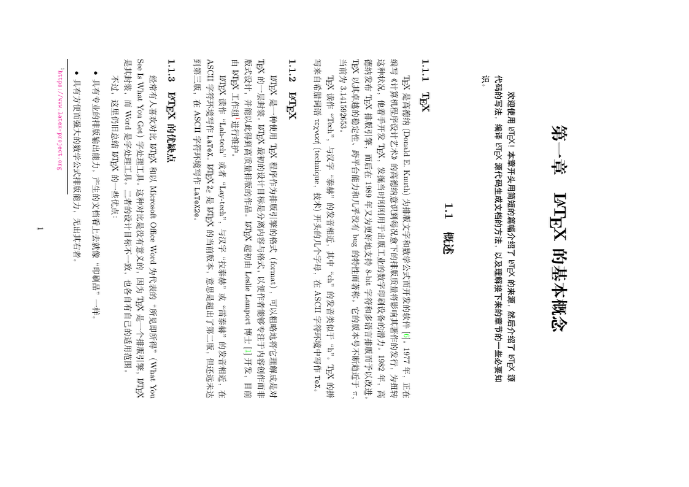

输入图片

模型分类：90°，置信度0.9254

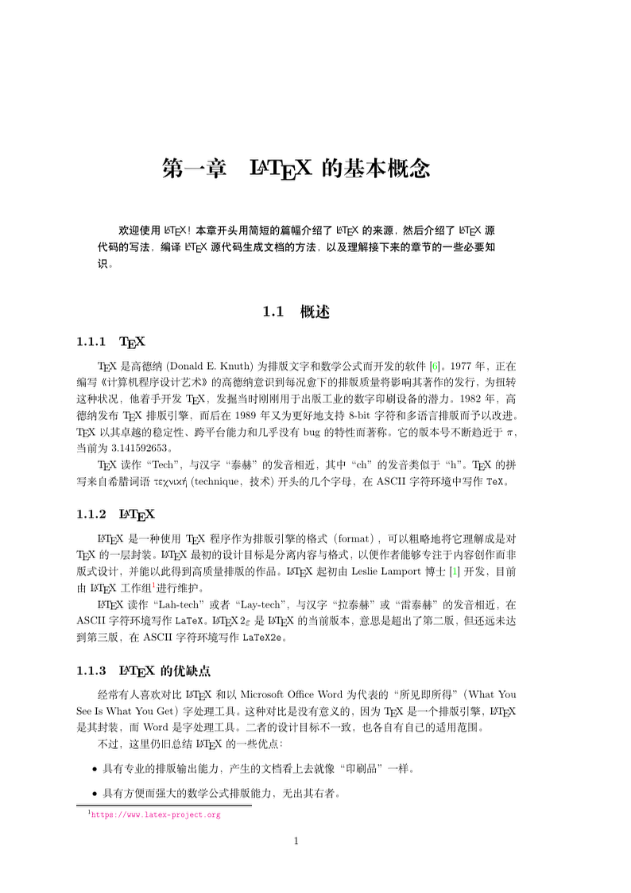

根据模型分类结果进行校正后的图片。

该方法也可以用于对表格旋转进行校正，个人测试少数数据，比rapid table中的table_cls和qanything_cls效果好一点。

然后就是个人应用到项目中的一些经验，实际应用中存在一个前提，大部分文档不存在旋转，即0°的图像占了99%甚至更多，而模型不能达到百分百的准确度。假设，每一百张0°的图中有一张被分错类，而确实旋转的图片有99%被分类对，那也是个不划算的事情。因此可以根据模型输出的置信度来控制，尽量避免对0°的图片分错类。个人思路是：

如果分类为非0°，只有置信度大于0.8（可根据情况调整）的才进行旋转校正，否则不旋转。

实际用下来至少没惹祸，这个技巧就是不求做对，但求不错。

## 四、文档图像去倾斜加校正一把抓

正如前面所说，如果是做知识库的自动文档解析，实际需求中是希望整个流程尽量自动化，所以个人弄了个去倾斜加校正的模块，其中模型来自（https://drive.google.com/file/d/1nP0E_woKzKSAZsNByJMqTqlH9bitrX_E/view）。

📄 **完整实现代码请参阅**：[deskew_and_rotation_correction.py](deskew_and_rotation_correction.py)

核心功能：
- 去倾斜：基于 FFT + 自适应径向投影（参数：amax=45, V=2048, W=304, D=0.55）
- 旋转校正：基于 ONNX 模型预测
- 单次旋转：合并两个角度，避免二次旋转帧来的质量损失

**运行示例**：
```python
python deskew_and_rotation_correction.py input.jpg
```

输入：

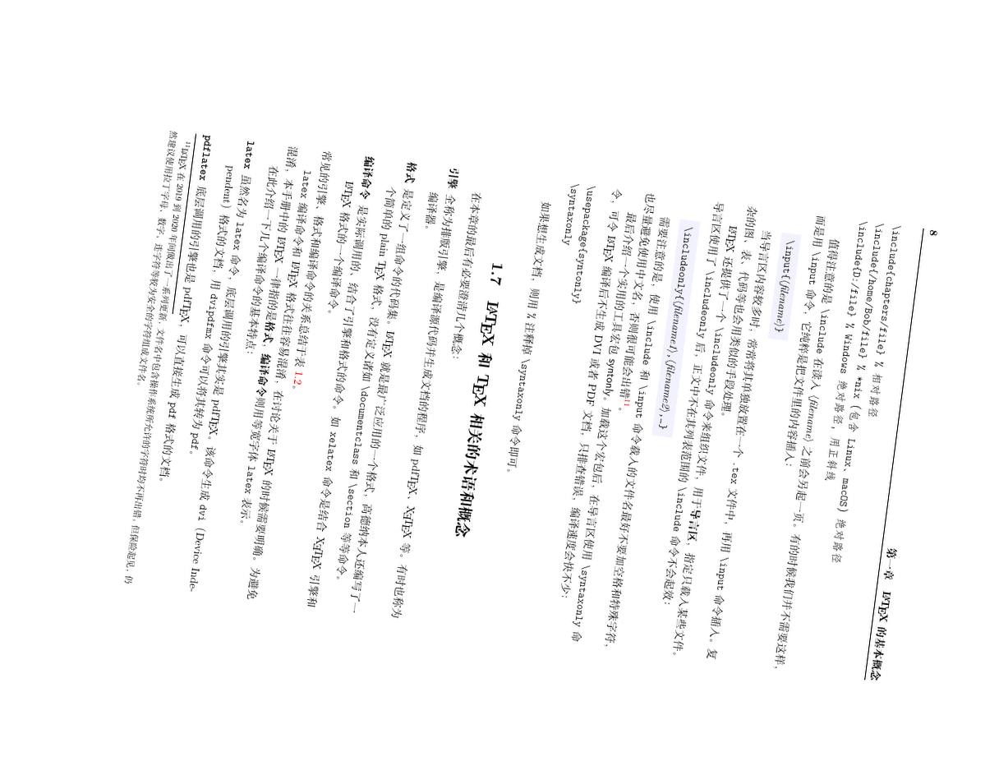

输出：

```cpp
✓ 去倾斜角度: -7.43°
✓ 旋转校正角度: 90°
✓ 合并角度: 97.43° (逆时针旋转)
```

校正结果（逆时针旋转97.43°）：

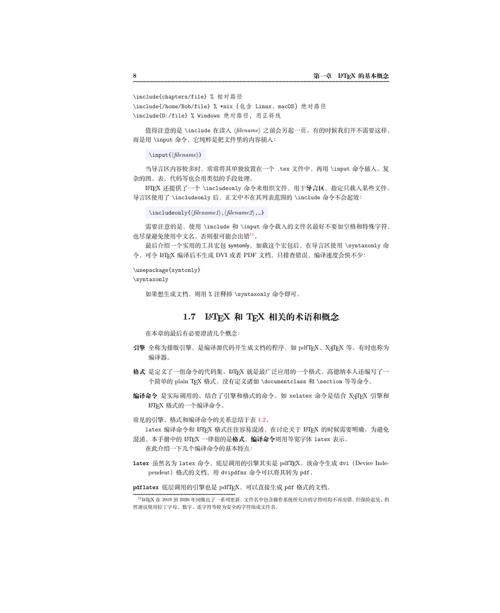

对存在倾斜和旋转的图像进行的校正就这样了，考虑到旋转校正依赖于模型，可以考虑根据前面提到的方法来优化：

> 然后就是个人应用到项目中的一些经验，实际应用中存在一个前提，大部分文档不存在旋转，即0°的图像占了99%甚至更多，而模型不能达到百分百的准确度。假设，每一百张0°的图中有一张被分错类，而确实旋转的图片有99%被分类对，那也是个划算的事情。因此可以根据模型输出的置信度来控制，尽量避免对0°的图片分错类。个人思路是：
>
> 如果分类为非0°，只有置信度大于0.8（可根据情况调整）的才进行旋转校正，否则不旋转。

至少保证不出错。

## 五、图像质量优化

前面提到，为了保证图片内容完整，旋转时画布较大导致白边较多。这里介绍一个预处理方法来裁剪多余的白边，保留文字信息。

📄 **完整实现代码请参阅**：[text_crop_optimized.py](text_crop_optimized.py) 和 [visualize_crop_pipeline.py](visualize_crop_pipeline.py)

输入：

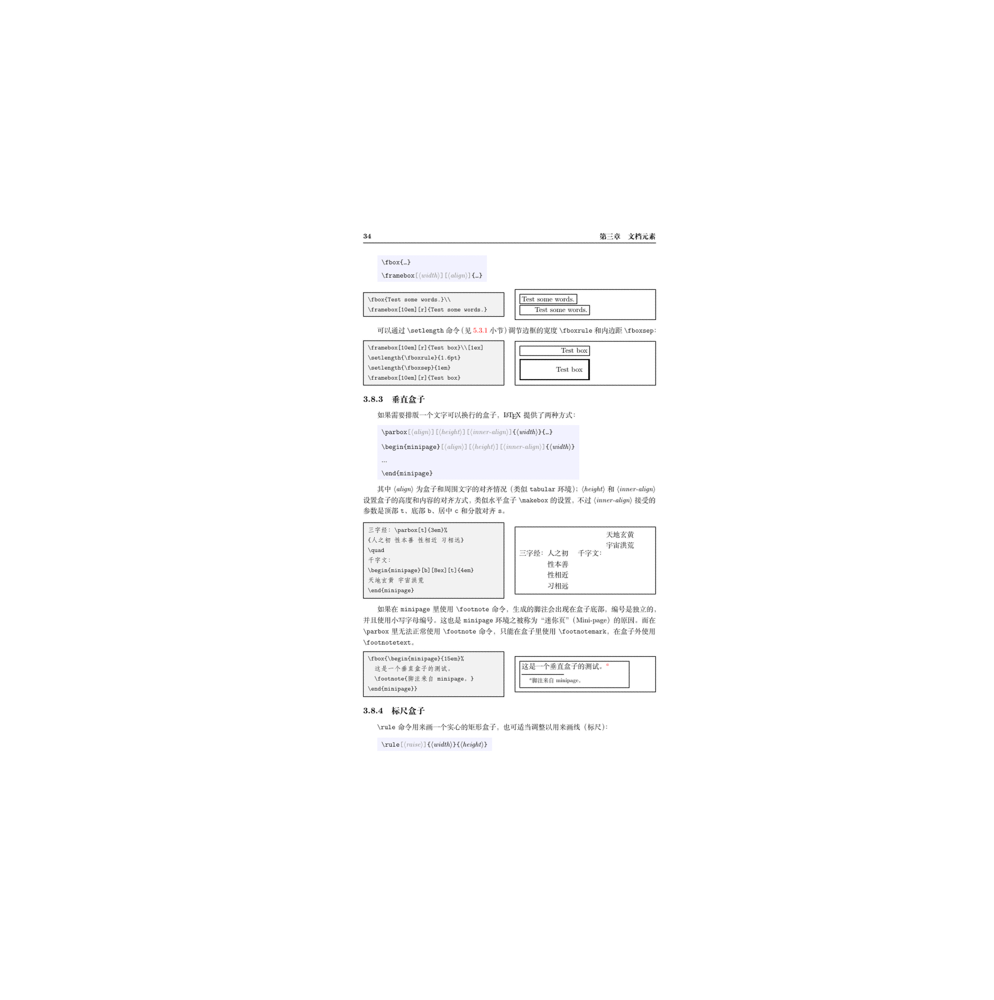

输出：

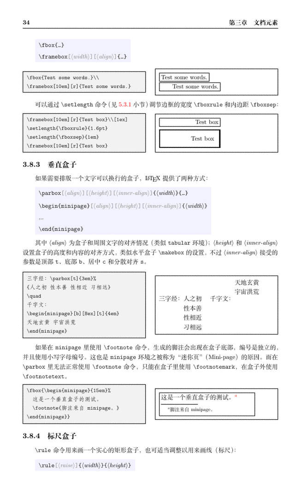

### 处理流程说明与中间过程可视化

流程：

1. 灰度化，转为黑白；
2. 高斯模糊，平滑图像，消除噪点；
3. 二值化，去除背景干扰；
4. 膨胀，扩张非背景元素，让它们互相之间粘连在一起，方便后续获取文本框；
5. 获取文本框，用opencv找出所有闭合的形状，这里会过滤掉面积太小、面积太大和长宽比极端的区域；
6. 区域合并，找出所有文本框的最小 $x$、$y$ 坐标和最大 $x$、$y$ 坐标，确定覆盖所有文本的唯一框；
7. 裁剪、加白边（提高ocr效果）和缩放。

以下是中间过程可视化：


原图


灰度图

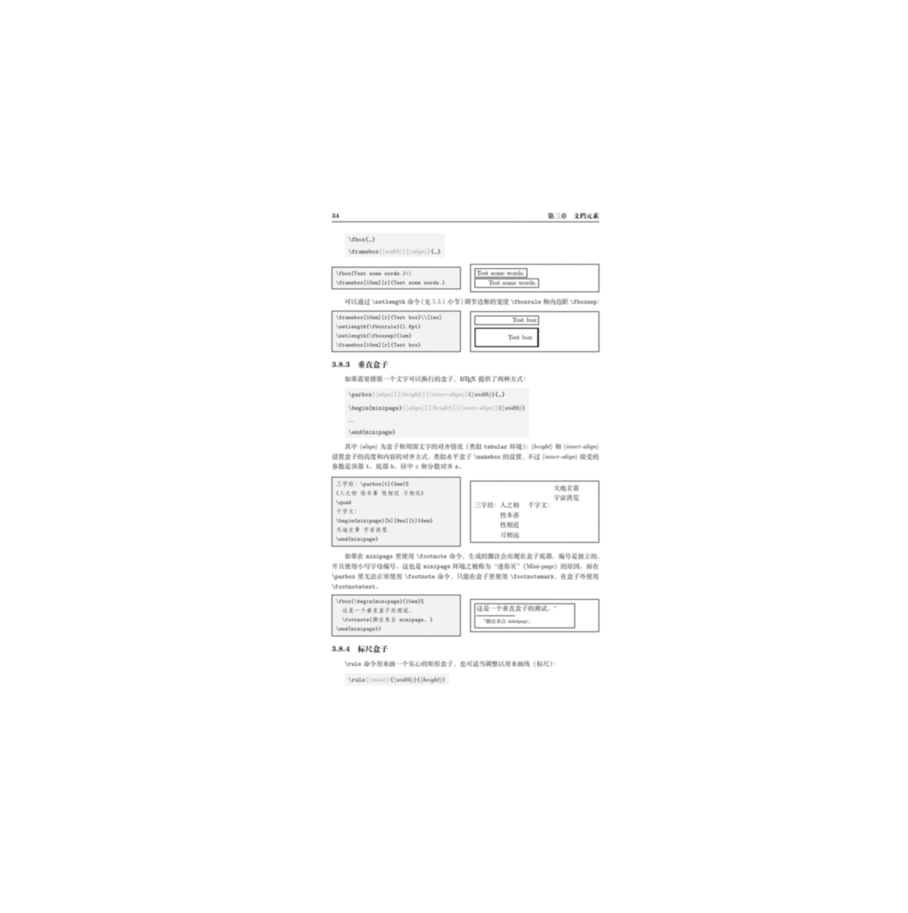

高斯模糊的结果

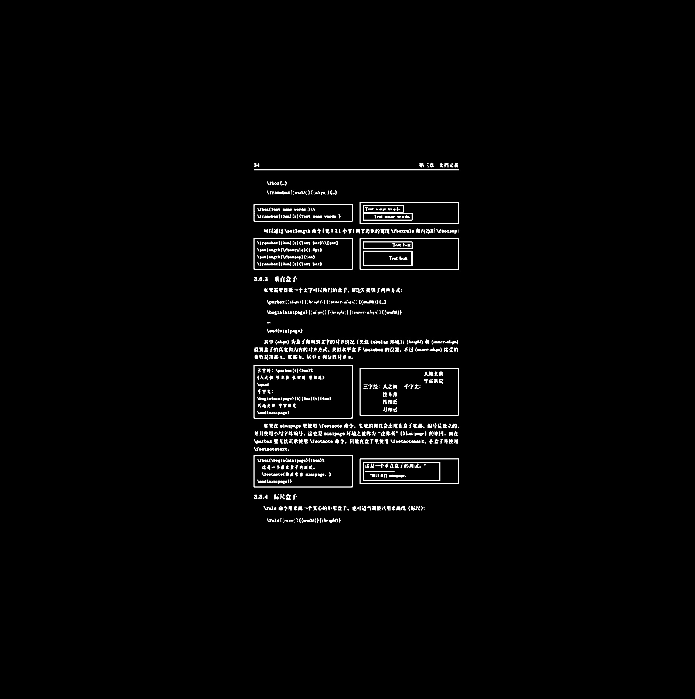

二值化图

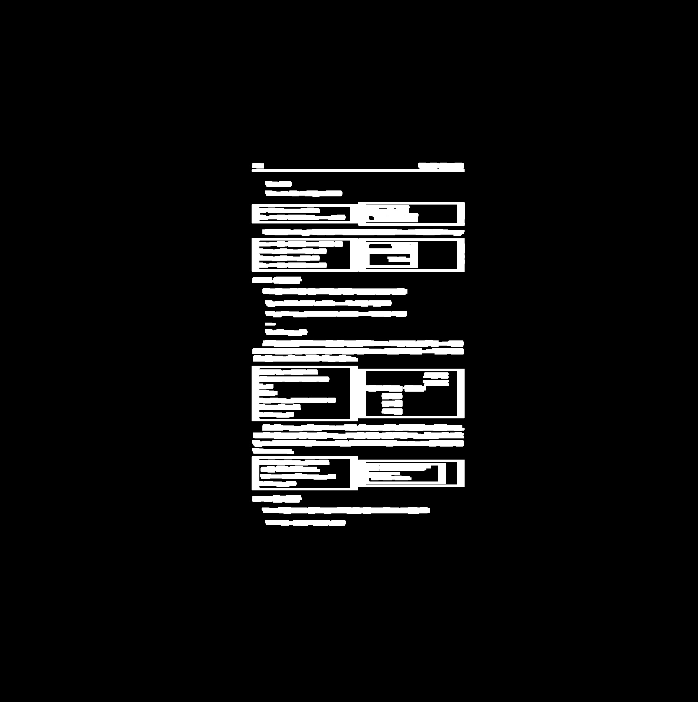

膨胀之后的操作

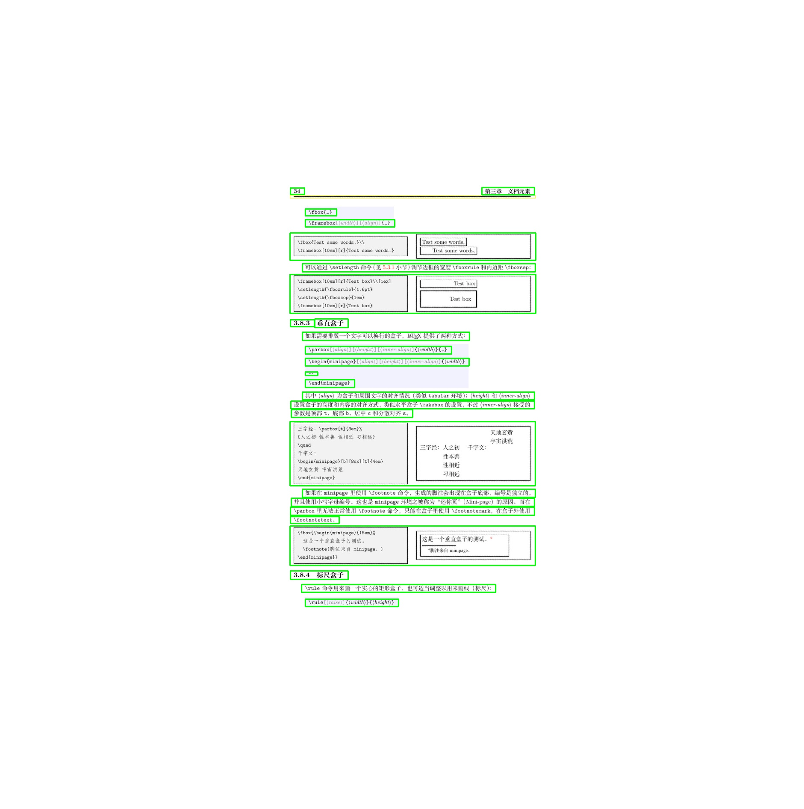

根据膨胀后的二值化图确定文本框位置

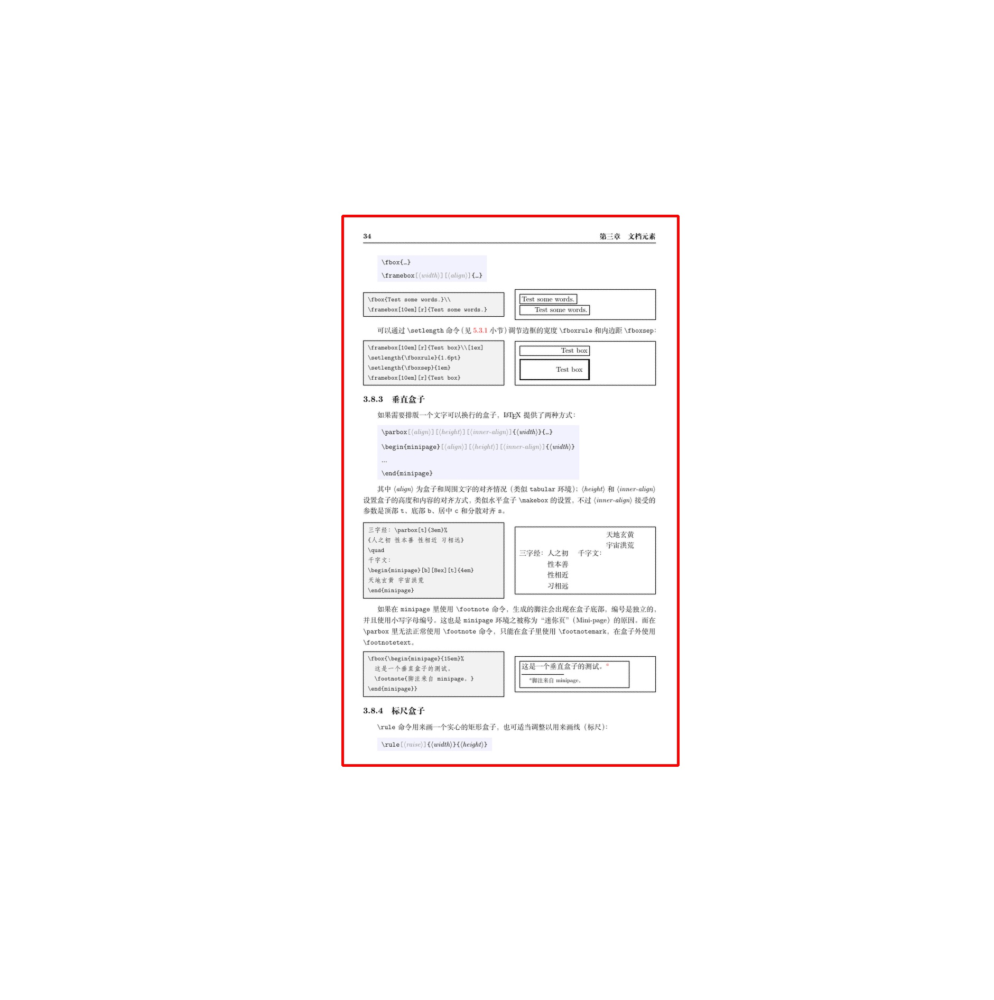

合并文本框，只留包含所有文本框的唯一大框

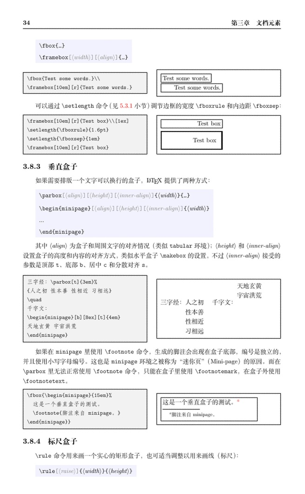

裁剪+填充白边+resize的结果


代码助手：Claude + Gemini

写作助手：Gemini3 PRO Preview

人类苦工：我
